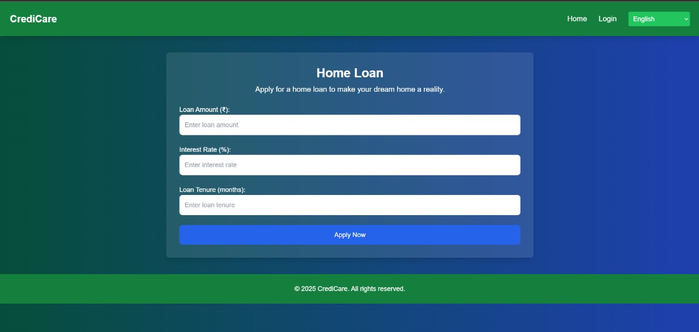

# AI Branch Manager

## Overview
AI Branch Manager is a multilingual web-based application designed to assist users with loan applications. It provides an intuitive interface where users can explore different loan options, use an EMI calculator, and interact with an AI-powered branch manager.

## Features
- 🌍 **Multi-language Support:** Supports English, Hindi, Tamil, and Telugu.
- 🏠 **Loan Options:** Users can choose from Home Loan, Car Loan, Education Loan, and Personal Loan.
- 🧮 **EMI Calculator:** Helps users estimate their loan repayments.
- 📹 **Video Call Support:** Users can start a video call with an AI agent.
- 🎨 **Responsive UI:** Designed  for a seamless experience.

## Pages Included
- `index.html` - Home Page
- `home-loan.html` - Home Loan Information
- `car-loan.html` - Car Loan Information
- `education-loan.html` - Education Loan Information
- `personal-loan.html` - Personal Loan Information
- `emi_calculator.html` - EMI Calculator Page
- `get_started.html` - Login/Registration Page

## Implementation Screenshots

### Home Page


### Home Loan Page


### EMI Calculator


### Login Page


### Register Page


### Multi-language Support


### Video Call Feature


## Installation & Usage
1. **Clone the repository:**
   ```sh
   git clone https://github.com/Jebin-Santhosh/AI-Branch-Manager.git
